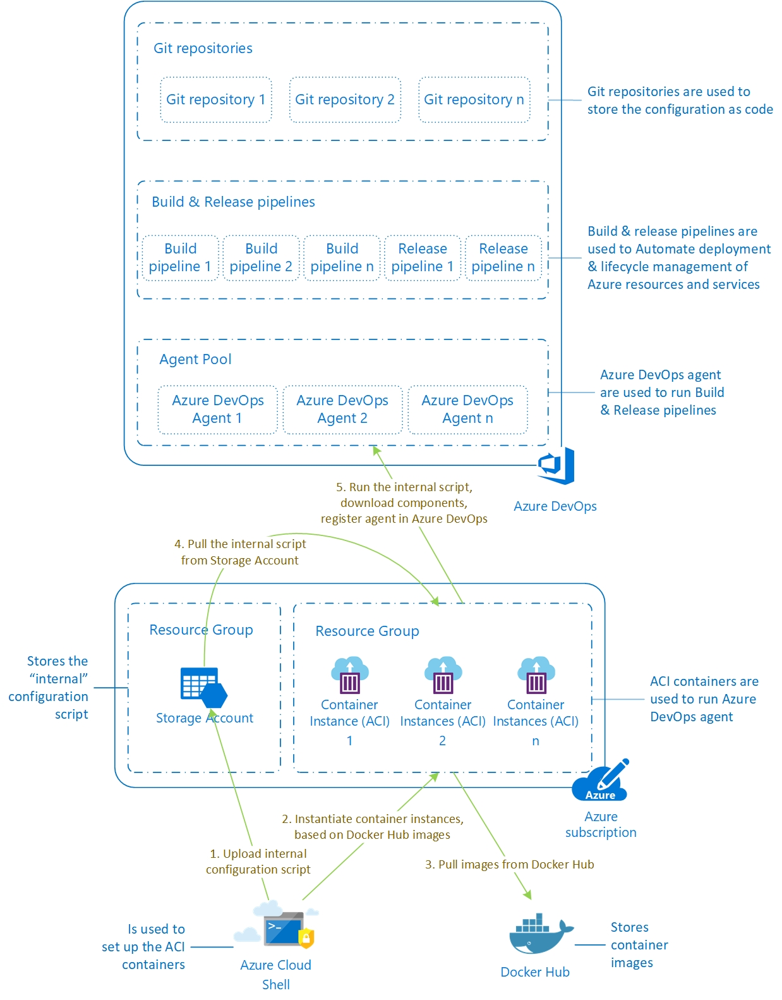

# Azure DevOps (formerly VSTS) Agents on Windows Server Core containers, using Azure Container Instances (ACI)

## 0. Table of content

- [Azure DevOps (formerly VSTS) Agents on Windows Server Core containers, using Azure Container Instances (ACI)](#azure-devops-formerly-vsts-agents-on-windows-server-core-containers-using-azure-container-instances-aci)
    - [0. Table of content](#0-table-of-content)
    - [1. Concept](#1-concept)
        - [1.1. Azure DevOps](#11-azure-devops)
        - [1.2. Using Azure DevOps for managing Azure infrastructure](#12-using-azure-devops-for-managing-azure-infrastructure)
        - [1.3. Azure Container Instances](#13-azure-container-instances)
        - [1.4. Problem statement](#14-problem-statement)
    - [2. How does the solution work?](#2-how-does-the-solution-work)
        - [2.1. Initialize-VstsAgentOnWindowsServerCoreContainer.ps1](#21-initialize-vstsagentonwindowsservercorecontainerps1)
        - [2.2. Install-VstsAgentOnWindowsServerCoreContainer.ps1](#22-install-vstsagentonwindowsservercorecontainerps1)
        - [2.3. Remove-VstsAgentOnWindowsServerCoreContainer.ps1](#23-remove-vstsagentonwindowsservercorecontainerps1)
        - [2.4. Diagram](#24-diagram)
    - [3. Prerequisites](#3-prerequisites)
    - [4. How to manage the solution's lifecycle](#4-how-to-manage-the-solutions-lifecycle)
        - [4.1. Initialize ACI containers in Azure Cloud Shell](#41-initialize-aci-containers-in-azure-cloud-shell)
        - [4.2. Update ACI containers](#42-update-aci-containers)
        - [4.3. Delete ACI containers](#43-delete-aci-containers)

## 1. Concept

### 1.1. Azure DevOps

To understand what this article provides a solution for, let's take a quick look on what Azure DevOps is. According to the official documentation, [Azure DevOps](https://docs.microsoft.com/en-us/azure/devops/user-guide/what-is-azure-devops-services?view=vsts) Services (formerly known as Visual Studio Team Services, or VSTS) is a cloud service for collaborating on code development. It provides an integrated set of features that you access through your web browser or IDE client, including the following:

- Git repositories for source control of your code
- Build and release services to support continuous integration and delivery of your apps
- Agile tools to support planning and tracking your work, code defects, and issues using Kanban and Scrum methods
- A variety of tools to test your apps, including manual/exploratory testing, load testing, and continuous testing
- Highly customizable dashboards for sharing progress and trends
- Built-in wiki for sharing information with your team

### 1.2. Using Azure DevOps for managing Azure infrastructure

I'm an infrastructure engineer, so why should I care about all of this? Isn't it something for developers only? Well, not really.

Azure DevOps can be used as a centralized end-to-end orchestration tool for managing Azure infrastructure, including many aspects of a customer's Azure platform, such as subscription, resource group and resource management, RBAC, policies, etc.

In a typical Azure environment/project, various components of Azure DevOps can be used for solving problems, such as:

- Private [Git repositories](https://docs.microsoft.com/en-us/azure/devops/repos/git/overview?view=vsts) to store all the configuration to be used in Azure. This includes not only 1st party technologies, such as [ARM templates](https://docs.microsoft.com/en-us/azure/azure-resource-manager/templates-cloud-consistency), PowerShell scripts, but also 3rd parties, such as [Terraform](https://www.terraform.io/) or [Packer](https://www.packer.io/). This approach is often referred as "[Infrastructure as Code](https://docs.microsoft.com/en-us/azure/devops/learn/what-is-infrastructure-as-code)":
    - *Infrastructure as Code (IaC) is the management of infrastructure (networks, virtual machines, load balancers, and connection topology) in a descriptive model, using the same versioning as DevOps team uses for source code. Like the principle that the same source code generates the same binary, an IaC model generates the same environment every time it is applied. IaC is a key DevOps practice and is used in conjunction with continuous delivery.*
    - *Infrastructure as Code evolved to solve the problem of environment drift in the release pipeline. Without IaC, teams must maintain the settings of individual deployment environments. Over time, each environment becomes a snowflake, that is, a unique configuration that cannot be reproduced automatically. Inconsistency among environments leads to issues during deployments. With snowflakes, administration and maintenance of infrastructure involves manual processes which were hard to track and contributed to errors.*
- [Wiki](https://docs.microsoft.com/hu-hu/azure/devops/project/wiki/about-readme-wiki?view=vsts) for storing and publishing the documentation: in an ideal case, an Azure environment's documentation is not handled as a static entity (i.e. a Word document), but it's rather a living, dynamic thing. The closer the documentation is stored to the code that is used for configuring the environment, the higher the chance is that it will be well-maintained.
- [Build and Release pipelines](https://docs.microsoft.com/en-us/azure/devops/pipelines/agents/agents?view=vsts) to orchestrate the Azure environment based on the code stored in Git repositories. All the steps defined in a Build or Release pipeline are run on agents - which in the background run on VMs. Agents come in two flavors: Microsoft-hosted and self-hosted.
    - [Microsoft-hosted agents](https://docs.microsoft.com/en-us/azure/devops/pipelines/agents/hosted?view=vsts&tabs=yaml) are provided as part of the Azure DevOps platform. It is quite convenient to start with them, as you don't have anything to install/configure/manage.
    - [Self-hosted agents](https://docs.microsoft.com/en-us/azure/devops/pipelines/agents/v2-windows?view=vsts) can be used, if you hit any limitations of the Microsoft-hosted ones, or you would like to use a more customized / more performing / more locked-down etc. environment to run your pipelines.
- [Azure Boards](https://docs.microsoft.com/en-us/azure/devops/boards/get-started/what-is-azure-boards?view=vsts&tabs=new-nav) to organize, track and schedule the whole team's work.

### 1.3. Azure Container Instances

Containers are becoming the preferred way to package, deploy, and manage cloud applications. [Azure Container Instances](https://docs.microsoft.com/en-us/azure/container-instances/container-instances-overview) offers the fastest and simplest way to run a container in Azure, without having to manage any virtual machines and without having to adopt a higher-level service. Azure Container Instances is a great solution for any scenario that can operate in isolated containers, including simple applications, task automation, and build jobs.


### 1.4. Problem statement

One of our customers decided to use Azure DevOps as their primary automation tool for Azure workloads. To achieve this, the following components are needed:
- Private Git repositories hosted on Azure DevOps to store the configuration scripts (e.g. Terraform and ARM templates, and PowerShell scripts).
- Build/Release pipelines to define which activities (e.g. applying Terraform templates or running PowerShell scripts) should be run in which order, with what parameters, in which Azure subscription, etc.
- A place to run these pipelines from. There are 2 options for this: using the Microsoft-hosted agents or implementing a set of self-hosted ones. Reminder: agents provide runtimes for pipelines on VMs (for more details see the description [above](#12-using-azure-devops-for-managing-azure-infrastructure)).

As this customer wanted to have full control over the agent machines, had concerns about using a shared, multi-tenant platform for this purpose, and was afraid of hitting any of the [technical limitations](https://docs.microsoft.com/en-us/azure/devops/pipelines/agents/hosted?view=vsts&tabs=yaml#capabilities-and-limitations) of the platform-provided agents, the default choice of using Microsoft-hosted agents fell quickly into the no go category. 

To fulfill these requirements, namely to enable the customer to run Build/Release pipelines in a scalable, customized and highly secured environment, we clearly needed to implement a set of self-hosted agents.

Requirements summary:

- Scalability: a solution which can both scale-up (i.e. the number of CPU cores and the amount of RAM can be increased) and scale out (multiple instances can be added to support parallel deployments) was desired.
- Customization: this includes adding extra components, such as PowerShell modules or the Terraform executable, and not having unnecessary and unused components installed.
- Security: interactive logons have to be prohibited, incoming requests on all ports of these machines must be denied.

As the customer prefers using PaaS services over IaaS VMs, and has strict security requirements, using the well-documented approach for deploying agents on VMs - what you would normally do - could not come into question.

Luckily, Azure offers this relatively new service, called Azure Container Instances (ACI), using which customers can run containers without managing the underlying infrastructure. As this service is now generally available (GA), it was a perfect choice for this customer.

This solution is simple, yet secure and has multiple benefits over using IaaS VM:

- It does not use public IP's. It doesn't need one, as the Azure DevOps agent initiates the communication to the service.
- It does not have any exposed ports. There's no need for publishing anything.
- Logging in to these containers is not possible (console and network access is not available) - only the configuration script's outputs can be read, as these are printed to the console.
- There's no need to maintain a VNET or any other infrastructure pieces, as these ACI instances can exist on their own.
- Has a lightweight footprint.
- Can be provisioned very quickly: to fully configure a container instance with the required components takes 5-10 minutes.
- Is immutable: it does not need patching/management. For version upgrades, the existing instances have to be deleted, and the new ones can easily be re-created by running the provision scripts again.

## 2. How does the solution work?

The solution consists of 3 scripts - all have to be placed to the same folder:
1. [Initialize-VstsAgentOnWindowsServerCoreContainer.ps1](Initialize-VstsAgentOnWindowsServerCoreContainer.md) - the external, "wrapper" script.
2. [Install-VstsAgentOnWindowsServerCoreContainer.ps1](Install-VstsAgentOnWindowsServerCoreContainer.md) - the container configuration script (internal script, runs inside of the containers) - this should never be invoked directly.
3. [Remove-VstsAgentOnWindowsServerCoreContainer.ps1](Remove-VstsAgentOnWindowsServerCoreContainer.md) - removal script that can be used to delete containers that are no longer required.

### 2.1. Initialize-VstsAgentOnWindowsServerCoreContainer.ps1

The wrapper script can be invoked from any location (including Azure Cloud Shell), that has the required components installed (see the [prerequisites](#Prerequisites)  below). The wrapper script copies the internal, container configuration script to a publicly available storage container of the requested Storage Account, it creates a new Resource Group (if one doesn't exist with the provided name), removes any pre-existing ACI containers with the same name, within the same Resource Group, then creates new ACI container instance(s) based on the provided names and invokes the container configuration script inside the container(s). The container(s) are based on the latest version of the official Windows Server Core image (microsoft/windowsservercore LTSC) available on Docker Hub.

### 2.2. Install-VstsAgentOnWindowsServerCoreContainer.ps1

The internal, container configuration script downloads and installs the latest available version of the Azure DevOps agent, and registers the instance(s) to the selected Agent Pool. It also configures the instance(s) with the latest version of Terraform and the selected PowerShell modules (by default AzureRM, AzureAD, Pester). 
After the successful configuration, it prints the available disk space and keeps periodically checking that the "vstsagent" service is in running state. Failure of this service will cause the Container instance to be re-initialized. If this happens and the PAT token is still valid, the container will auto-heal itself. If the PAT token has already been revoked, or has been expired by this time, the container re-creation will fail.

### 2.3. Remove-VstsAgentOnWindowsServerCoreContainer.ps1

This removal script removes the selected Azure Container Instance(s). It leaves the Resource Group (and other resources within it) intact.

### 2.4. Diagram



## 3. Prerequisites

- Azure Subscription, with an existing Storage Account
- Access to Azure Cloud Shell (as the solution has been developed for and tested in Cloud Shell)
- You need to have admin rights:
  - To create a storage container within the already existing Storage Account *- OR -*  a storage container with the public access type of "Blob" has to exist,
  - To create a new Resource Group *- OR -*  an existing Resource Group for the Azure Container Instances,
  - To create resources in the selected Resource Group.
- Azure DevOps account with the requested Agent Pool has to exist.
- Permission in the Azure DevOps account to add agents to the chosen Agent Pool.
- A PAT token.
  - A PAT token can only be read once, at the time of creation.
  - PAT tokens cannot be used for privilege escalation.
  - To learn more about PAT tokens, visit the [Use Personal Access Tokens to Authenticate](https://docs.microsoft.com/en-us/azure/devops/organizations/accounts/use-personal-access-tokens-to-authenticate?view=vsts) site.

## 4. How to manage the solution's lifecycle

### 4.1. Initialize ACI containers in Azure Cloud Shell

- Get access to the Azure DevOps account where you would like to create the new agents. You might need to have rights to create a new Agent Pool if the requested one doesn't exist.
- Get a PAT token for agent registration (Agent Pools: read, manage; Deployment group: read, manage). To see detailed description of this step, visit the [Deploy an agent on Windows](https://docs.microsoft.com/en-us/azure/devops/pipelines/agents/v2-windows?view=vsts) page of Azure DevOps documentation.
- Get access to the Azure Subscription where you need to deploy the ACI containers. See more details in the [Prerequisites](#Prerequisites) section above.
- Get access to Azure Cloud Shell. See "[Quickstart for PowerShell in Azure Cloud Shell](https://docs.microsoft.com/en-us/azure/cloud-shell/quickstart-powershell)" for more details.
- Copy the below .ps1 script files to your Cloud Shell area:
  - [Initialize-VstsAgentOnWindowsServerCoreContainer.ps1](Initialize-VstsAgentOnWindowsServerCoreContainer.md)
  - [Install-VstsAgentOnWindowsServerCoreContainer.ps1](Install-VstsAgentOnWindowsServerCoreContainer.md)
  - [Remove-VstsAgentOnWindowsServerCoreContainer.ps1](Remove-VstsAgentOnWindowsServerCoreContainer.md)
- Run the below script to create containers in your selected region:

```powershell
Initialize-VstsAgentOnWindowsServerCoreContainer.ps1 -SubscriptionName "<subscription name>" -ResourceGroupName "<resource group name>" -ContainerName "<container 1 name>", "<container 2 name>", "<container n name>" -Location "<azure region 1>" -StorageAccountName "<storage account name>" -VSTSAccountName "<azure devops account name>" -PATToken "<PAT token>" -PoolName "<agent pool name>"
```

- In case you would like to have containers in any additional regions, re-run the script with a different "Locaion" parameter:

```powershell
Initialize-VstsAgentOnWindowsServerCoreContainer.ps1 -SubscriptionName "<subscription name>" -ResourceGroupName "<resource group name>" -ContainerName "<container 1 name>", "<container 2 name>", "<container n name>" -Location "<azure region 2>" -StorageAccountName "<storage account name>" -VSTSAccountName "<azure devops account name>" -PATToken "<PAT token>" -PoolName "<agent pool name>"
```

- If the container creation procedure fails, Azure automatically retries creating a new instance.
- Read the logs of each container.
  - In case of success, you can decide if you want to delete your PAT token. See more in "[Revoke personal access tokens to remove access](https://docs.microsoft.com/en-us/azure/devops/organizations/accounts/use-personal-access-tokens-to-authenticate?view=vsts#revoke-personal-access-tokens-to-remove-access)".
  - In case any unhandled errors occurred, you can re-run the script for the instance in question, using the "-ReplaceExistingContainer" switch (see the description below in the [Update ACI containers](#Update-ACI-containers) section).
- As long as your PAT token is valid, you can remove the agents' registration on the Azure DevOps portal. This will trigger the container to stop the Azure DevOps (VSTS) service, restart, and reapply all the settings defined in the container configuration script ("Install-VstsAgentOnWindowsServerCoreContainer").
- If the PAT token has already been removed, in order to update/re-register the containers, you'll have generate a new PAT token, remove the existing containers, and re-run the "Initialize-VstsAgentOnWindowsServerCoreContainer.ps1" script.

### 4.2. Update ACI containers

- If you would like to update your existing ACI containers, you can re-run the same ".\Initialize-VstsAgentOnWindowsServerCoreContainer.ps1" script using the "-RequiredPowerShellModules" switch as follows:

```powershell
Initialize-VstsAgentOnWindowsServerCoreContainer.ps1 -SubscriptionName "<subscription name>" -ResourceGroupName "<resource group name>" -ContainerName "<container 1 name>", "<container 2 name>", "<container n name>" -Location "<azure region 2>" -StorageAccountName "<storage account name>" -VSTSAccountName "<azure devops account name>" -PATToken "<PAT token>" -PoolName "<agent pool name>" -ReplaceExistingContainer
```

- This will wipe out the existing container(s), and re-register the new one(s) with the same name. Note that this will create a new agent registration in Azure DevOps, as the agent names are generated based on the following pattern: `<ACI container name>-<Date-Time in the format of yyyyMMdd-mmhhss>`
- Once the new container(s) have bee provisioned, the old agents become orphaned. These have to be manually deprovisioned on the Azure DevOps portal.

### 4.3. Delete ACI containers

- To remove the ACI containers that are no longer required, run the below script:

```powershell
Remove-VstsAgentOnWindowsServerCoreContainer.ps1 -SubscriptionName "<subscription name>" -ResourceGroupName "<resource group name>" -ContainerName "<container 1 name>", "<container 2 name>", "<container n name>"
```

- Once the containers have been removed, the agents on the Azure DevOps portal become orphaned. These have to be manually deprovisioned (deleted) on the portal.